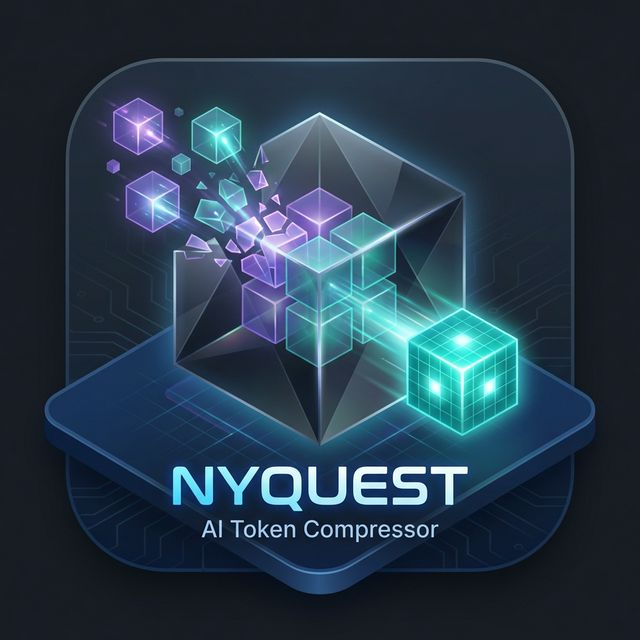

<div align="center">



# nyquest<span>.ai</span>

### Semantic Compression Proxy for LLMs

[](CHANGELOG.md)
[](https://rust-lang.org)
[](https://github.com/tokio-rs/axum)
[](src/compression/rules.rs)
[](tests/)
[](LICENSE)
[](https://nyquest.ai)

**Reduce LLM token usage by 15–75% without losing meaning.**

A drop-in HTTP proxy for LLM API traffic. Clients point at `localhost:5400` instead of `api.anthropic.com` (or any other provider) and Nyquest reduces the input token count, then forwards to upstream. Output is relayed unchanged. Works with Anthropic, OpenAI, Gemini, xAI, OpenRouter, and local models.

> *Oversampling wastes tokens. Undersampling distorts intent.*
> *Nyquest sits exactly on the boundary.*

[**→ nyquest.ai**](https://nyquest.ai) &nbsp;·&nbsp; [**How It Works**](https://nyquest.ai/how-it-works) &nbsp;·&nbsp; [**Docs**](https://nyquest.ai/docs-page)

---

| 📊 22.6% Aggregate / 75% Semantic | ⚡ <2ms Cold Latency | ♻️ ~3,730× Cache Hit Speedup | 🌐 6 Providers | 🪨 532 Rules / 19 Categories | 🦀 Full Rust |
|:---:|:---:|:---:|:---:|:---:|:---:|

---

</div>

## Capabilities

### Compression
- **532 regex rules across 19 categories** applied in tiered passes (filler removal → structural compression → aggressive canonicalization)
- **Per-model compression profiles** (aggressive / balanced / conservative) auto-selected from the model string in the request, with specific-marker matching (`mini` / `haiku` / `flash` / `nano` / `light` win over family-name substrings)
- **Sentence-level transforms** (preamble strip, tail trim, deduplication, imperative merging) via the telegraph stage
- **Code-block minification** for Python, JavaScript, and shell
- **Format optimization** — JSON → YAML / CSV conversion for tabular structures, markdown table flattening
- **Optional semantic stage** via local Qwen 2.5 1.5B (Ollama) for system-prompt and history condensation

### Performance
- **Zero-allocation rule misses** — `Cow<'a, str>` returns `Cow::Borrowed(text)` when no rule matches; allocates only on actual rewrites
- **`RegexSet` per-category prefilter** — only candidate rules run; non-matching rules are skipped without a full text scan
- **Single end-of-pipeline whitespace cleanup** — runs once per `compress_text` call, not per rule category
- **Bounded LRU compression cache** — keyed by `sha256(content) + level + profile + mode`, default 2048 entries / 64KB max entry size; ~3,730× speedup on cached repeated content (warm replay)

### Safety
- **`tool_use` and `image` blocks pass through byte-identical** — never modified
- **Markdown headings, Python tuples, four-digit dates, numeric prose preserved** — source-code rules gated to fenced code or confirmed JSON only
- **Role declarations preserved** — `You are a senior network engineer.` rewrites to `Role: senior network engineer.`, never deleted
- **Fail-closed length contract** — `compress_text` returns the original input if compression produced a longer string

### Observability
- **`/admin/v2/compression/rules`** — per-category and per-rule hit telemetry, no prompt content exposed
- **`/admin/v2/compression/cache`** — cache snapshot (size, capacity, hits, misses, evictions, stores)
- **`/metrics`** + **`/dashboard`** — live request-level metrics with token-saving aggregates

### Distribution
- **Docker image** with `--network host` for full throughput, healthcheck, non-root user (see [README_DOCKER.md](README_DOCKER.md))
- **Systemd unit** for direct binary deployment (`install.sh` configures both)
- **GHCR-published images** auto-built on every release tag

## Hardware Tiers

| Tier | Requirements | Capabilities | Savings |
|---|---|---|---|
| **Tier 1** | 2+ cores, 512 MB RAM | Rules only (532 rules, <2ms) | 15–35% |
| **Tier 2** | 4+ cores, 6+ GB RAM, 2+ GB VRAM | Rules + GPU semantic (Qwen 2.5) | 15–75% |
| **Tier 3** | 4+ cores, 8+ GB RAM | Rules + CPU semantic (1–4s latency) | 15–75% |

## Production Benchmark Results

Measured live on an Ubuntu 24.04 host, 2026-05-10. The
production deployment is the `nyquest:3.2.0` Docker container running
with `--network host` (bypasses `docker-proxy` for full throughput — see
[README_DOCKER.md](README_DOCKER.md) for the bridge vs host comparison).

### Engine

| Test | Result |
|---|---|
| Health check | v3.2.0, Rust engine, OpenClaw enabled |
| Compression @ L0.3 (358-token reference prompt) | 319 → 234 tokens — **26.6% savings** |
| Compression @ L0.5 | 319 → 229 tokens — **28.2% savings** |
| Compression @ L1.0 | 319 → 208 tokens — **34.8% savings** |
| Health throughput (single-thread, ab -n 5000 -c 1) | **8,266 req/s**, p50 < 1ms |
| Concurrent (ab -n 5000 -c 20) | **18,287 req/s**, p50 1ms, p95 1ms, p99 2ms |
| Failed requests | **0 / 10,000** |
| Resource usage | **48.5 MB RSS**, 15 threads (Docker container) |
| Cache snapshot (`/admin/v2/compression/cache`) | 6 entries / 2048 capacity, 0 evictions |
| Healthcheck integration | Docker `healthy` (curl /health, 30s interval) |

### Natural prompt compression — 8 real-world scenarios

| Scenario | Level 0.5 | Level 0.7 | Level 1.0 |
|---|---|---|---|
| Customer Support | 28.1% | 33.4% | **34.7%** |
| Legal Review | 14.1% | 16.0% | **27.5%** |
| Data Science | 14.6% | 16.5% | **18.1%** |
| Travel Planner | 22.9% | 23.3% | **25.9%** |
| Code Review | 11.7% | 13.8% | **20.7%** |
| Financial Advisor | 12.5% | 10.9% | **17.5%** |
| HR Policy | 11.6% | 13.6% | **18.2%** |
| Medical Education | 9.3% | 10.8% | **14.3%** |
| **AGGREGATE** | **15.9%** | **17.7%** | **22.6%** |

Totals across the 8-scenario suite at L1.0: **2,201 → 1,703 tokens**, saved
498 tokens (24 small upstream Anthropic Haiku calls, ~1¢ in API cost).

### Repeated-content cache effectiveness

Measured by `tests/v320_compression_report.rs`:

| Metric | Value |
|---|---|
| Cold compression of a ~500-char prompt | ~70.9 ms |
| Warm replay (cache hit) | ~19 µs |
| **Speedup factor** | **~3,730×** |
| Cache key | sha256(content) + level + profile + mode |
| Default capacity / max entry size | 2048 entries / 64KB |

### Test suite

| Suite | Tests | Status |
|---|---|---|
| `tests/compression_engine_regression.rs` (snapshot safety) | 16 | ✅ |
| `tests/v320_compression_report.rs` (measurement) | 6 | ✅ |
| `tests/role_based_test.rs` (25-persona aggregate) | 7 | ✅ |
| Lib unit tests (cache, format, minify, telegraph, cache_reorder) | 18 | ✅ |
| **Total** | **47** | **✅ 47/47** |

Reproduce locally:

```bash
cargo test                                      # all 47 tests
cargo test --test v320_compression_report -- --nocapture --test-threads=1
```

### Safety invariants verified live

| Invariant | Status |
|---|---|
| `tool_use` blocks pass through byte-identical | ✅ |
| `image` blocks pass through byte-identical | ✅ |
| Python tuple syntax preserved (`('foo',)`) | ✅ |
| Numeric prose preserved (`Result: 42`) | ✅ |
| Four-digit years preserved (`1999-01-14`, `2099-01-14`) | ✅ |
| Length contract holds (compression never inflates output) | ✅ |
| Markdown headings not stripped by source-code rules | ✅ |
| Role-only prompts never emptied | ✅ |

## Cost Impact at Scale

Projected from the measured aggregate savings on the 8-scenario suite
(L0.7: 17.7% / L1.0: 22.6%) at 100M input tokens per month.

| Model | Price/1M Input | 100M tok/mo | Monthly Savings @ L0.7 (17.7%) | Monthly Savings @ L1.0 (22.6%) |
|-------|---------------|-------------|---------------------------------|---------------------------------|
| Claude Haiku 4.5 | $0.25 | $25 | **$4.43** | **$5.65** |
| Claude Sonnet 4.5 | $3.00 | $300 | **$53.10** | **$67.80** |
| Claude Opus 4.5 | $15.00 | $1,500 | **$265.50** | **$339.00** |
| GPT-4o | $2.50 | $250 | **$44.25** | **$56.50** |
| Grok 3 | $3.00 | $300 | **$53.10** | **$67.80** |

## How It Works

```
Your Agent ──▶ Nyquest (localhost:5400) ──▶ LLM API ──▶ Response ──▶ Your Agent
                  │
                  ├── 1. Normalize (dedup, conflict resolution, speculation boundaries)
                  ├── 2. OpenClaw Agent Mode (7-strategy agentic optimization)
                  ├── 3. Cache Reorder (sort for provider prefix caching)
                  ├── 4. Rule Compress (532 rules across 19 categories, telegraph, code minify, format optimizer, LRU cache)
                  ├── 5. Semantic LLM (Qwen 2.5 1.5B via Ollama — 56% system, 75% history)
                  ├── 6. Auto-scale + Forward (dynamic level, provider routing)
                  └── Measure (token accounting, metrics, dashboard)
```

Nyquest reads the `model` field (or `x-nyquest-base-url` header) to auto-detect the provider, translates between Anthropic and OpenAI formats as needed, compresses the prompt, and forwards to the upstream API. Responses (including SSE streams) pass through unmodified.

For the full engine architecture (data model, hot path walkthrough, per-rule
telemetry, cache internals, profile system, extension points), see
[docs/ARCHITECTURE.md](docs/ARCHITECTURE.md).

## Compression Levels

| Level | Strategy | Typical Savings |
|-------|----------|----------------|
| 0.0 | Pass-through (metrics only) | 0% |
| 0.2 | Filler removal (~77 rules: openclaw + filler) | 5–10% |
| 0.5 | + structural (~340 rules: + verbose, imperative, clause collapse, dev-boilerplate, semantic-formatting, credential, whitespace) | 15–25% |
| 0.7 | Default — balanced | 18–30% |
| 1.0 | Aggressive + format + minify (all 532 rules across 19 categories) | 25–37% |

### What Gets Compressed

System prompts, user messages, tool results, embedded code blocks, JSON payloads, markdown content. **Assistant responses** in conversation history are also compressed using lighter, progressive rules — older turns get deeper compression while recent turns stay intact.

### Response Compression (Multi-Turn)

In multi-turn conversations, older assistant responses accumulate noise: "I'd be happy to help!", verbose explanations, over-formatted markdown. Nyquest compresses these with a separate, conservative pipeline that preserves semantic content while stripping fluff:

| Tier | Rules Applied |
|---|---|
| Always | AI output noise ("Great question!", "Let me know if...") |
| Level 0.5+ | Markdown minification, whitespace cleanup, inline JSON compaction |
| Level 0.8+ | Filler/verbose stripping, code minification, format optimization, telegraph |

The `response_compression_age` config (default: 4) controls how many recent turns are left untouched. Override per-request with `x-nyquest-response-age` header.

```yaml
# In nyquest.yaml
compress_responses: true
response_compression_age: 4  # Only compress assistant turns older than 4 from the end
```

### What Is NEVER Modified

Tool/function schemas (names, parameters, types), image blocks, audio blocks, API response bodies, `model`/`max_tokens`/`temperature` parameters, cache control markers.

## Six-Stage Pipeline

### Stage 1: Normalizer

Deduplicates repeated instructions, resolves conflicting constraints, injects speculation boundaries, strips role re-declarations. Runs at all non-zero compression levels.

### Stage 2: OpenClaw Agent Mode

7-strategy optimization pipeline for autonomous agentic systems:

| Strategy | What It Does |
|---|---|
| Tool Result Pruning | Truncates oversized tool outputs, deduplicates repeated results |
| Schema Minimization | Removes optional fields, collapses descriptions in tool definitions |
| Thought Block Compression | Strips verbose chain-of-thought from multi-turn agent loops |
| Error Deduplication | Collapses repeated error messages into counts |
| Sliding Window | Drops old conversation turns when context fills |
| Cache Injection | Adds Anthropic cache_control markers for prefix caching |
| File View Condensation | Compresses repeated file content views |

Enable with header: `x-nyquest-openclaw: true`

### Stage 3: Cache Reorder

Sorts tool definitions and system blocks into a deterministic order that maximizes provider-side prefix cache hit rates. This is transparent to the model but can significantly reduce costs on providers that support prompt caching.

### Stage 4: Compression Engine

**532 regex rules** across 19 categories in three tiers:

| Category | Tier | Example |
|---|---|---|
| Filler phrases | 0.2+ | "due to the fact that" → "because" |
| Verbose phrases | 0.2+ | "your primary responsibility is to" → removed |
| Imperative conversions | 0.5+ | "you should always" → "always" |
| Clause collapse | 0.5+ | "in situations where" → "when" |
| Developer boilerplate | 0.5+ | Strip TODO/FIXME noise |
| Semantic formatting | 0.5+ | "for example" → "e.g." |
| Date compression | 0.5+ | "January 14th, 2025" → "2025-01-14" |
| Code minification | 0.8+ | Strip comments, collapse whitespace (Python/JS/Bash) |
| Format optimization | 0.8+ | JSON arrays → CSV, JSON objects → YAML |

Each rule has an atomic per-process hit counter exposed via
`/admin/v2/compression/rules` for tuning and dead-rule detection.

### Stage 5: Semantic LLM (optional)

When enabled, condenses system prompts (~56%) and conversation history
(~75%) via a local Qwen 2.5 1.5B Instruct model served by Ollama.
Latency: 200–350 ms on GPU, 1–4 s on CPU.

| Stage | System Prompts | Conversation History | Latency |
|---|---|---|---|
| Rules only (L1.0) | 26.6–34.8% | 14–22% | <2ms |
| Rules + Semantic | **55.9%** | **75%** | 200–350ms (GPU) |

### Stage 6: Auto-scale + Forward

Dynamic compression level selection based on context window utilization,
plus provider routing (Anthropic, OpenAI, Gemini, xAI, OpenRouter, local).

## Installation

```bash
# Clone
git clone https://github.com/Nyquest-ai/nyquest-rust-fullstack-3.2.0.git
cd nyquest-rust-fullstack-3.2.0

# Build
cargo build --release

# Configure
cp nyquest.yaml.example nyquest.yaml   # if present, otherwise edit nyquest.yaml directly

# Run
./target/release/nyquest
```

Or one-shot installer:

```bash
bash install.sh
```

Or Docker (recommended for production):

```bash
bash scripts/build.sh
bash scripts/run-local.sh
bash scripts/smoke-test.sh
```

See [README_DOCKER.md](README_DOCKER.md) for the full container deployment story.

## Configuration

```yaml
# nyquest.yaml
compression_level: 0.7
adaptive_mode: true
host: 0.0.0.0
port: 5400
log_metrics: true
log_file: logs/nyquest_metrics.jsonl
context_optimization: true
context_max_input_tokens: 20000
context_preserve_recent_turns: 3
openclaw_mode: true
compress_responses: true
response_compression_age: 4
semantic_enabled: false   # opt-in; requires Ollama + Qwen 2.5 1.5B
```

Environment variable overrides for the LRU cache:

| Variable | Default | Purpose |
|---|---|---|
| `NYQUEST_CACHE_ENABLED` | `true` | Master switch |
| `NYQUEST_CACHE_CAPACITY` | `2048` | Max entries |
| `NYQUEST_CACHE_MAX_ENTRY_SIZE` | `65536` | Max bytes per cached entry |

## Per-Request Headers

| Header | Effect |
|---|---|
| `x-nyquest-level: 0.0–1.0` | Override default compression level for this request |
| `x-nyquest-openclaw: true/false` | Toggle OpenClaw agent mode |
| `x-nyquest-response-age: N` | Compress assistant turns older than N from the end |
| `x-nyquest-base-url: https://...` | Route to a specific upstream provider |

## Docs

- **[CHANGELOG.md](CHANGELOG.md)** — release notes
- **[docs/ARCHITECTURE.md](docs/ARCHITECTURE.md)** — engine architecture (data model, hot path, telemetry, cache, profiles, extension points)
- **[README_DOCKER.md](README_DOCKER.md)** — container build, run, healthcheck, smoke test
- **[CONTRIBUTING.md](CONTRIBUTING.md)** — local setup + git hooks

## License

MIT OR Apache-2.0.

---

<div align="center">


**[nyquest.ai](https://nyquest.ai)** &nbsp;·&nbsp; Built by [Nyquest AI](https://github.com/Nyquest-ai) &nbsp;·&nbsp; [Docs](https://nyquest.ai/docs-page)

</div>
